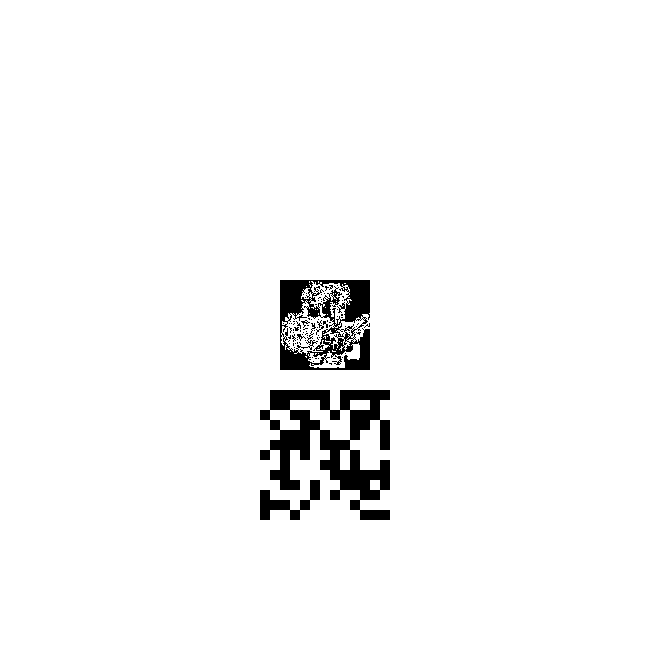
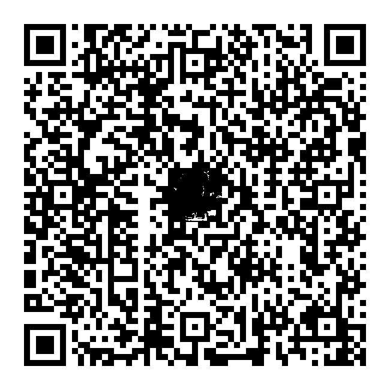

# WriteUp

拿到图片后使用binwalk分析，发现文件是由一个gif和一个zip组成的，直接使用binwalk提取效果不好，可以编写脚本分割。

```python
zip_head = b'\x50\x4B\x03\x04'
with open('pig.png', 'rb') as f:
    data = f.read()
idx = data.find(zip_head)
with open(gif_path, 'wb') as f:
    f.write(data[:idx])
with open(zip_path, 'wb') as f:
    f.write(data[idx:])
```

分割后的压缩包加密，根据提示信息判断动图中藏有压缩包的密码。使用`convert`命令分割gif的每一帧。

```shell
convert pig.png out.png
```

使用Stegsolve分析其中任意一帧，在blue通道的最低位发现隐藏的信息。



将所有帧中的blue通道的最低位绘制在同一张图中，并以黑色显示，脚本如下：

```python
from PIL import Image
image  = Image.open(gif_path)
size   = image.size
qrcode = Image.new('RGB', size, 'white')
k = 0
while True:
    try:
        image.seek(k)
        img = image.convert('RGB')
        for i in range(size[0]):
            for j in range(size[1]):
                r,g,b = img.getpixel((i,j))
                if b!=255:
                    qrcode.putpixel((i,j), (0,0,0))
        k += 1
    except:
        break
qrcode.save('out/qrcode.png')
```



扫码得到字符串`JUZFU2C2NJTTETKUKF3VUQJ5HU======`，经过base32和base64解码得到压缩包的密码`3faf86140d`，解压后得到猪圈密码的图片，对照符号即可解出flag。