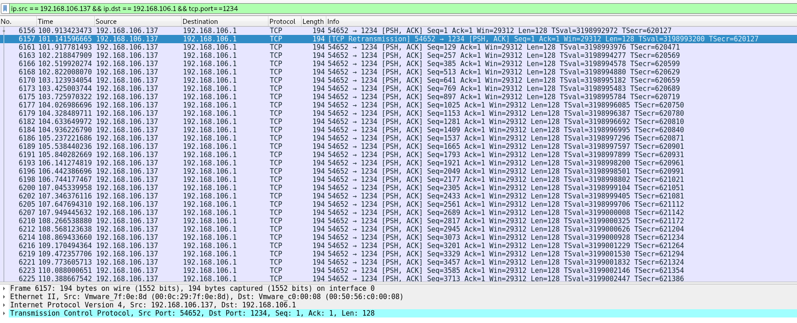
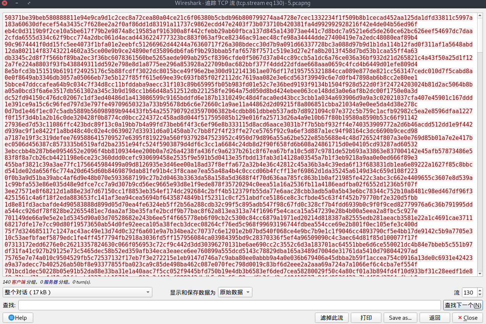

先分析流量包，直接提取HTTP对象，由于题目说是内网之间的通信，可以提取出从192.168.106.1中请求的rsapublickey.pem。

但是并不能直接看出这个公钥的内容，再结合题目中所说的水印系统，可确定该文件加了水印，将其与标准的rsa公钥相对比，可以从最开始的**-----BEGIN PUBLIC KEY-----**对比发现水印系统算法为16字节一循环，每字节与0-0xf相异或。可得到水印系统核心算法如下：

```python
i = 0
while(i < len(raw)):
    out += chr(ord(raw[i]) ^ (i % 0x10))
    i += 1
```

可解出无水印的rsa公钥为

```
-----BEGIN PUBLIC KEY-----
MIGfMA0GCSqGSIb3DQEBAQUAA4GNADCBiQKBgQDssm9ZinmX+W5RtOG/kMzoNPFc
8kcPw9EVkong/sqcdPvGhakj2g3lBlnWetfB4Jm/AdK+MyEjUMmp5czOE2Fi9RL3
+LH16w4gz3+im/9DYpSmRELD5p9k9wW4XvuAugV8ntePfq26gPoxi+lhNAJ0dYIH
myIdQnSq9Gqw6NVxJQIDAQAB
-----END PUBLIC KEY-----
```

用openssl可提取出公钥中的信息

```shell
openssl rsa -pubin -in rsapublickey.pem -text
openssl rsa -pubin -in rsapublickey.pem -modulus
```

提取出模数后可用yafu进行分解提取出两个质数p、q，求出该则可求出该密钥对的私钥部分。

现在又回到流量包中，从刚刚请求rsa公钥的流量包可分析出，192.168.106.1为持有公钥对，192.168.106.137持有私钥对。对流量包进行筛选，分析可得到这次通信是192.168.106.1往192.168.106.137的2333端口发信，.137往.1的1234端口发信。跟踪tcp流后发现为非明文信息，再根据前面公私钥对的持有情况，可以得出该流量包中的流量为加密流量的结论。

接下来根据发信顺序来进行解密，首先在wireshark中筛选出.106往.1的2333端口发信的流量。

```python
ip.src == 192.168.106.137 && ip.dst == 192.168.106.1 && tcp.port==1234
```



由于模数n限制的原因，因此分多次进行传输，现跟踪流可从原始数据将所有流量包数据提取出来，每段可以以\n进行识别



再利用求出的私钥进行解密，解密的关键代码如下：

```python
def decode(text):
    tmp = hex(pow(int(text , 16) , d , n))[2:].strip('L')
    if(len(tmp) % 2):
        tmp = '0' + tmp
    return tmp.decode('hex')

raw = f.read().strip('\n').split('\n')
for i in range(len(raw)):
    l += decode(raw[i])
```

解出的数据可以看到大部分为不可见字符，只有第一段为明文：**Cxk, come and play basketball![cxk.jpg]**可知道后面为附件cxk.jpg，由于都是从有水印系统的计算机中进行传输的，因此同样时带了水印的图片，同样对其去除水印，可发现是一张表情包(误导项)。


以同样的方法，将.1往.137的1234端口发信的流量进行解密，得到第一句话为**Dark number right![secret.wav]**，可知道后面跟了一个secret.wav的附件，并根据英文**Dark number right!**(暗号正确)可得出flag在这个wav里面。将wav进行去水印处理后，听一下发现是有杂音的鸡你太美。对照wav的数据结构分析其二进制文件，发现很多采样的地方都是01，有悖于正常的wav音频采样规律，可猜测为wav文件的LSB隐写(题目也有提示，左声道的lsb)，然后利用脚本提取出最低位，得到flag为**flag{033897ac-e36f-4f23-a7d8-b5996b7031be}**，提取脚本如下：

```python
import re
with open('secret.wav') as f:
    raw = f.read()
    f.close()
head = raw[:0x2c]
datas = raw[0x2c:]
data = re.findall('.{4}' , datas)
left_data = []
right_data = []
for i in range(len(data)):
    left_data.append(data[i][:2])
    right_data.append(data[i][2:])

lsb = ''

for i in range(len(left_data)):
    lsb += bin(int(left_data[i].encode('hex') ,16))[2:].rjust(16 , '0')[7]

string = ''
aa = re.findall('.{8}' , lsb)
for i in range(len(aa)):
    string += chr(int(aa[i] , 2))

print string[:42]
```

PS:文件夹中rsafrompcap为从流量包中直接提取的带水印公钥，std_rsapublickey.pem为openssl生成的标准rsa公钥用来对比，rsapublickey.pem为去水印后的公钥，unwater.py为去水印脚本；137->1.txt为流量包中.137向.1发的加密流量，1->137.txt为流量包中.1向.137发的加密流量，decodepcap.py为解密脚本，解出后分别得到文件cxkfrompcap和secretfrompcap，文件夹中的两个文件为去除第一句明文后的解密信息，即带水印的jpg和wav，同样用unwater.py进行去水印。最后wav的lsb隐写用exp.py进行提取即可得到flag。
